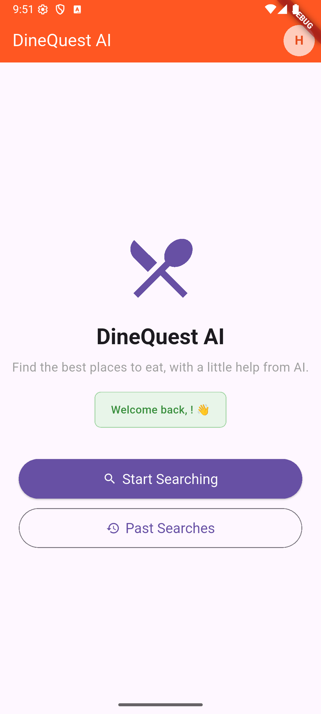
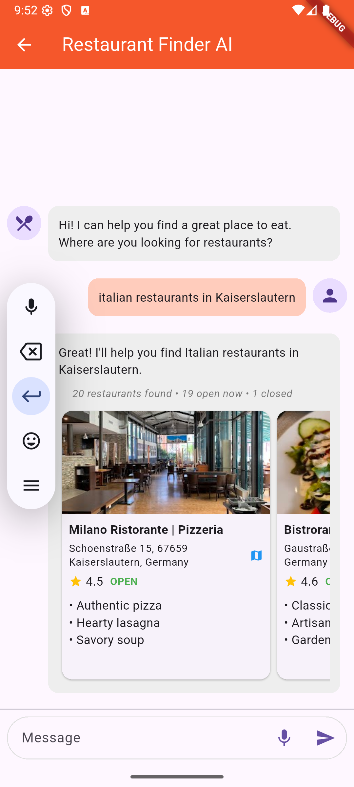

# DineQuest AI 🍽️

**Find somewhere to eat by asking for it in plain language.**

DineQuest AI is a full-stack restaurant finder. You describe what you want, in
speech or text, and a pipeline uses Gemini to work out what you meant,
searches Google Places, and answers with real restaurants, their opening status,
and a short summary of what each one is known for.

A Flutter app talks to a FastAPI backend. The backend orchestrates the agents,
calls Google Maps Platform, and persists conversations to Firestore so you can
pick up an earlier search.

<p align="center">
  
  
</p>

---

## Features

- **Conversational search.** Ask for "italian restaurants in Kaiserslautern" and
  get results. Ask for something too vague, like "food in Germany", and the app
  asks which city you mean rather than guessing.
- **Voice in and out.** Speak your request, and hear the reply read back.
- **Open-now awareness.** Results are ordered with open restaurants first, then
  closed ones by how soon they open, with a readable "opens tomorrow at 11:30"
  label.
- **Widening search.** If a location is sparse, the search radius expands from
  5km to 20km to 50km rather than returning nothing.
- **Conversation history.** Past searches are stored per user and can be
  reopened, renamed, or deleted.
- **Multiple sign-in methods.** Email and password with verification, Google,
  and phone.

---

## Architecture

```
Flutter app                     FastAPI backend                  Google
-----------                     ---------------                  ------
chat screen  ──── POST /chat ──▶ auth: verify Firebase ID token
                                        │
                                        ▼
                                 ChatAgent ─────────────────────▶ Gemini
                                   (intent, location, cuisine)
                                        │
                                        ▼
                                 SearchAgent ───────────────────▶ Geocoding API
                                   (widening radius)  ──────────▶ Places API (New)
                                        │
                                        ├── PhotoAgent ─────────▶ (photo reference)
                                        └── PresentationAgent (review excerpts)
                                        │
                                        ▼
                                 Firestore  (conversation history)

image  ◀──── authenticated photo resolution ──▶ key-free image URL
```

### Design notes

**The API key never reaches the client.** Google returns photo *references*, not
image URLs, and turning one into an image needs the Maps key. Rather than
building a URL with the key in it and handing that to every device, the client
resolves the photo through its authenticated API client with `?redirect=false`,
then loads the credential-free image URL Google returns. Resolution uses bounded
caches and deduplicates concurrent requests. Photos require sign-in; shared
Firestore quotas limit requests across Cloud Run instances.

**Identity comes from the token, never the request.** Every endpoint that
touches user data takes the caller's ID from a verified Firebase ID token.
There is no `user_id` parameter to tamper with. Verification uses Google's
public signing certificates, so it needs no service account and behaves the same
locally as on Cloud Run.

**Successful replies are durable.** A complete exchange and its metadata commit
in one transaction before the API returns success. Firestore calls run on worker
threads. Storage outages return errors; memory storage must be explicitly chosen
for local development and is forbidden on Cloud Run. Deletion purges messages
and keeps only a content-free marker to prevent late requests recreating them.

**Responsibilities are separated.** Flutter's chat controller owns request state
and cancellation; a repository owns server access and local caching. Search,
photo references and review summaries use plain pipeline stages. Only ChatAgent
needs a language model. Summaries label food mentions from reviews as unconfirmed
availability and never infer menu items from cuisine alone.

---

## Tech stack

| Layer | Choice |
| --- | --- |
| App | Flutter, Dart SDK ^3.8.1 |
| HTTP | Dio, with an interceptor that attaches and refreshes ID tokens |
| Voice | `speech_to_text`, `flutter_tts` |
| API | FastAPI, Uvicorn, Python 3.12 |
| Agents | LangChain with `langchain-google-genai` |
| Model | Gemini 2.5 Flash Lite |
| Places data | Google Maps Platform: Geocoding API, Places API (New) |
| Auth | Firebase Auth, verified server-side with `google-auth` |
| Storage | Cloud Firestore |
| Hosting | Google Cloud Run |

---

## Getting started

### Prerequisites

- Flutter SDK 3.x and an emulator or device
- Python 3.12
- A Firebase project with Authentication and Firestore enabled
- A Google Maps Platform API key with **Geocoding API** and **Places API (New)**
  enabled
- A Gemini API key from [Google AI Studio](https://aistudio.google.com/apikey)

The two Google keys are separate. The Maps key is restricted to the two Maps
APIs above; the Gemini key is for the language model.

### 1. Backend

```bash
cd backend

python3.12 -m venv .venv
source .venv/bin/activate          # Windows: .venv\Scripts\activate
pip install -r requirements.txt

cp .env.example .env               # then fill in your keys
uvicorn app.main:app --host 0.0.0.0 --port 8080 --reload
```

`backend/.env` needs:

```bash
GOOGLE_API_KEY=          # Gemini
GOOGLE_MAPS_API_KEY=     # Geocoding + Places (New)
FIREBASE_PROJECT_ID=     # whose ID tokens this API will accept
STORAGE_BACKEND=memory  # explicit local mode; use firestore for durable history
ALLOWED_ORIGINS=         # comma-separated; leave empty for mobile-only
HOST=0.0.0.0
PORT=8080
```

Check it came up with `curl http://localhost:8080/health`. It reports storage
health and initialization status for all four pipeline stages.

Memory mode loses history on restart. To use Firestore locally, run
`gcloud auth application-default login`, set `STORAGE_BACKEND=firestore`, and
grant the authenticated identity access to the default Firestore database.
Storage uses `FIREBASE_PROJECT_ID` unless `FIRESTORE_PROJECT_ID` overrides it.
Existing `.env` files must choose memory explicitly if cloud storage is unavailable.

### 2. Frontend

```bash
cd frontend

# point the app at your backend
echo "API_URL=http://10.0.2.2:8080" > .env   # Android emulator
# echo "API_URL=http://localhost:8080" > .env  # iOS simulator, web, desktop

flutter pub get
flutter run
```

`10.0.2.2` is how the Android emulator reaches your host machine. A physical
device needs your machine's LAN address instead, and both devices must be on the
same network.

The app requires sign-in. Every backend call carries a Firebase ID token, so a
signed-out app receives `401` on conversation and photo endpoints. Health and
documentation endpoints are public.

Enable Google in Firebase Authentication before testing Google sign-in. Android
needs registered signing fingerprints and a downloaded `google-services.json`
containing a Web OAuth client. Alternatively set the public Web client ID as
`GOOGLE_SIGN_IN_SERVER_CLIENT_ID` in `frontend/.env`. iOS needs its OAuth client
ID (`GOOGLE_SIGN_IN_CLIENT_ID`) and reversed client ID URL scheme in
`ios/Runner/Info.plist`. These are client identifiers, never API secrets.
See the [Android plugin setup](https://pub.dev/packages/google_sign_in_android)
and [iOS plugin setup](https://pub.dev/packages/google_sign_in_ios).

---

## API

All conversation endpoints require an `Authorization: Bearer <firebase-id-token>`
header.

| Method | Path | Purpose |
| --- | --- | --- |
| `GET` | `/health` | Service and agent status |
| `POST` | `/chat` | Send a message, get a reply and restaurant suggestions |
| `GET` | `/conversations?limit=50&cursor=…` | Metadata page: `{items, next_cursor}` |
| `GET` | `/conversations/{id}/full` | One conversation with all messages |
| `GET` | `/conversations/{id}/messages` | Messages only, optionally limited |
| `POST` | `/conversations/{id}/messages` | Append a message |
| `PATCH` | `/conversations/{id}/title` | Rename a conversation |
| `DELETE` | `/conversations/{id}` | Delete a conversation and all messages |
| `GET` | `/photos/{place_id}/{photo_id}?redirect=false` | Authenticated photo URL resolution |
| `GET` | `/conversations/health` | Storage backend status |

Interactive docs are at `/docs` when the server is running.

Conversation IDs must be UUIDs. Messages reject blank content. List requests
accept limits of 1–100; message limits select the newest 1–500 messages in
chronological order. Follow `next_cursor` until null, including any empty pages
caused by deletion markers. `/full` remains an explicit full-history export.
Chat is limited to 10 requests per user per minute; photo resolution to 120 per
user per minute, with 600 upstream photo fetches per minute across the service.
Upstream failures return 502, storage outages 503, and quota exhaustion 429.

## Automated checks

From the repository root, after installing backend dependencies:

```bash
backend/.venv/bin/python -B backend/test_system.py
# Include real Firestore transactions without touching a cloud project:
npm install -g firebase-tools@14.17.0
firebase emulators:exec --only firestore --project demo-dineout-review \
  --config backend/firestore-emulator.json 'backend/.venv/bin/python -B backend/test_system.py'

cd frontend
flutter pub get
flutter analyze
flutter test
```

The emulator requires Java 21 for the CI configuration. Without the emulator,
Firestore contract tests are explicitly skipped; API, memory and agent tests
still run. Gemini, Maps and Firebase Authentication are replaced by fakes in
these tests. CI runs both storage implementations plus Flutter analysis/tests.

---

## Deployment

The backend is built for Cloud Run.

```bash
export PROJECT_ID=your-cloud-project
export FIREBASE_PROJECT_ID=your-firebase-project
bash backend/deploy.sh
```

The script enables the required APIs, prompts for both keys and stores them in
Secret Manager as `google-api-key` and `google-maps-api-key`, builds the image,
and deploys with a dedicated runtime service account and Artifact Registry image.
See [deployment requirements](backend/DEPLOYMENT.md) for IAM and database setup.
`cloud-run-service.yaml` provides an equivalent service template.

After deploying, point the app at the service URL by setting `API_URL` in
`frontend/.env`, and add that origin to `ALLOWED_ORIGINS` if you serve the app
on the web. Deploy the client and backend together for the new pagination and
authenticated photo contracts.

---

## Project structure

```
.
├── backend/
│   ├── app/
│   │   ├── agents/          # ChatAgent, SearchAgent, PhotoAgent, PresentationAgent
│   │   ├── auth/            # Firebase ID token verification
│   │   ├── conversations/   # router, service, models, utils
│   │   ├── photos/          # photo redirect route
│   │   ├── storage/         # shared contract, Firestore and explicit memory mode
│   │   ├── models/          # shared request and response models
│   │   └── main.py          # app setup, middleware, lifecycle
│   ├── Dockerfile
│   ├── deploy.sh
│   ├── cloud-run-service.yaml
│   └── .env.example
│
├── frontend/
│   ├── lib/
│   │   ├── config/          # API base URL resolution
│   │   ├── controllers/     # chat state and cancellation
│   │   ├── models/          # conversation models
│   │   ├── screens/         # login, signup, verification, phone, past searches
│   │   ├── services/        # auth providers, HTTP client, local storage
│   │   ├── widgets/         # auth wrapper, restaurant cards and photos
│   │   ├── chat_screen.dart
│   │   └── landing_screen.dart
│   └── firestore.rules      # deny-all; the client never reads Firestore directly
│
└── docs/                    # screenshots
```

---

## Known limitations

Kept here deliberately rather than left for a reader to discover.

- **Native sign-in needs project configuration.** OAuth clients, Android signing
  fingerprints and the iOS callback scheme must match the app. Desktop Firebase
  options still contain placeholders; Linux is not configured.
- **Provider data has limits.** Opening labels use the venue timezone or its
  reported UTC offset and remain unknown without either. Offset-only data cannot
  predict a future daylight-saving change. Places location bias is not a hard
  geographic boundary; review mentions are not a verified menu.
- **Legacy data is not automatically migrated.** Existing metadata may lack
  previews until the next write. Old orphaned messages can be purged by repeating
  deletion for the original conversation ID. Deletion markers are retained to
  reject stale writes, and a failed deletion can be retried to finish cleanup.
- **Live provider flows need device testing.** Automated checks cover behavior
  with fakes and the local Firestore emulator, not consent screens or billed APIs.
- **Firebase App Check is not enabled.** The Firebase client keys are public by
  design, and App Check is the control that stops them being used outside the
  real app.
